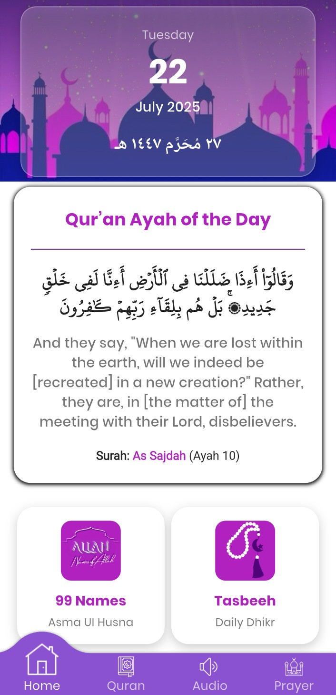
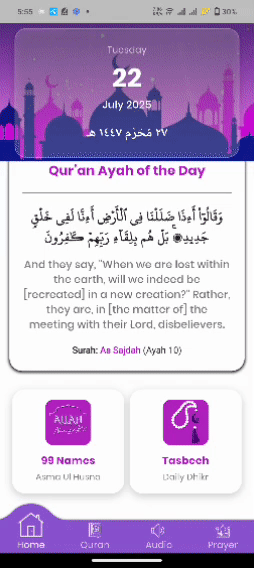
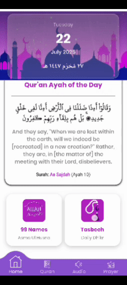
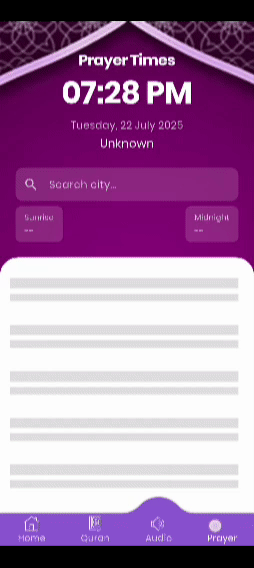

# 📖 The Holy Qur'an — Flutter App

A beautifully designed **Al-Quran** mobile app built using Flutter. It offers complete Quranic Surahs and Juz navigation, smooth audio playback (streaming & offline), smart connectivity handling, Tasbeeh counter, and a beautiful Asma ul Husna screen — all packed in a modern UI.  
I’ve made the app as offline-friendly as possible — you can download Surah audio for offline listening.

> ✨ More features will be added in future updates. Contributions are welcome — fork the repo and help make it even better!

<div align="center">

[](#)
[](https://github.com/ahsxndev/quran-app/fork)
[](https://github.com/ahsxndev/quran-app/issues)
[](#)

</div>

---

## 📥 Download Now

> 📱 *Coming Soon to Play Store*

> 🚧 Currently available via source code installation below.

---

## 🎥 Demo Video

[](https://vimeo.com/1103451235)

---

## ⚙ Installation

✅ Supports **Flutter 3.22+** & **Dart 3.x**
Built with **null safety**, background audio, and full offline support.

To run this project locally:

1. **Clone the Repository**

   ```bash
   git clone https://github.com/ahsxndev/quran-app.git
   ```

2. **Navigate to the project directory**

   ```bash
   cd quran-app
   ```

3. **Install dependencies**

   ```bash
   flutter pub get
   ```

4. **Run the app**

   ```bash
   flutter run
   ```
> 🗑️ **Note**: The `media_assets` folder inside the `assets` folder is for GitHub preview images only. You can delete it after cloning.

> ⚠️ Run on a real device to test download, storage, and background audio features.

---

## 📸 Screenshots

### 📱 Main Features  
<div align="center"> 
   
   
   
   
</div>

### 🔊 Audio & Islamic Tools  
<div align="center"> 
   
   
   
   
</div>


---

## 📁 Features

* 📖 Complete **Surah & Juz Navigation**
* 🎧 Audio Playback with:

  * Online/Offline Support
  * Background Play
  * Seek, Repeat, Auto-next, Speed
* 📥 Surah Audio Downloads
* 🌐 Internet-aware Playback Retry
* 🔄 Shimmer Placeholders (Loading UI)
* 🧮 Digital Tasbeeh Counter with Vibration
* 💎 Asma ul Husna (99 Names)
* 📆 Gregorian + Hijri Date
* 📡 Location-based Namaz Timing
* 🎨 Custom Fonts, Consistent UI

---

## 🔗 API & Data

* **Quran Data**: Provided by [`quran`](https://pub.dev/packages/quran) package
* **Hijri & Timezone**: Calculated locally using packages
* **Namaz Times**: via [`prayers_times`](https://pub.dev/packages/prayers_times)

---

## 📦 Packages Used

A complete list of pub.dev packages can be found in [`pubspec.yaml`](./pubspec.yaml). Key packages:

* `just_audio` / `just_audio_background`
* `connectivity_plus`, `dio`, `intl`, `location`, `geocoding`, `vibration`
* `shimmer`, `audio_video_progress_bar`, `shared_preferences`

---

## 🧪 Test Checklist

* ✅ Fully works **offline** after Surah download
* ⚠️ Requires permissions: **Storage**, **Internet**, **Location**
* ✅ Background audio, haptic feedback & shimmer verified

---

## 🔑 License

Licensed under the [MIT License](LICENSE).

---

## 👤 Author

### Ahsan Zaman

[](https://github.com/ahsxndev)
[](https://linkedin.com/in/ahxanzaman)

If you find this app helpful, kindly ⭐ the repo and share your feedback or suggestions!
